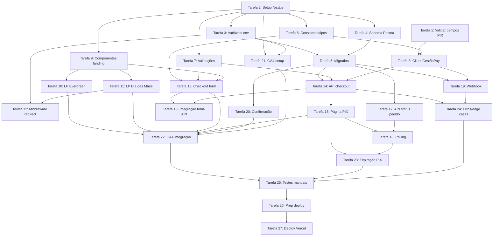

# Tasks — Diário Bíblico (MVP)

> **Versão**: 1.0  
> **Data**: 2026-04-13  
> **Referência**: `docs/requirements.md` + `docs/design.md` + `docs/gestaopay-normalizado.md`

---

## Tarefa 1: Validação dos campos PIX na resposta da GestãoPay ✅ CONCLUÍDA

**Arquivo(s) afetado(s):** `docs/gestaopay-normalizado.md`  
**Depende de:** Nada  
**Status:** ✅ Concluída em 2026-04-14  
**Descrição:**  
Fazer uma chamada de teste real para `POST /v1/payment-transaction/create` com `payment_method: "pix"` e capturar a resposta completa. Documentar os nomes exatos dos campos PIX retornados (QR Code, copia-e-cola, expiração).

**Resultados obtidos:**
- ✅ Chamada POST de criação de PIX executada com sucesso (HTTP 201)
- ✅ Chamada GET de busca de transação executada com sucesso (HTTP 200)
- ✅ Campos PIX mapeados: `data.pix.qr_code` (copia-e-cola EMV), `data.pix.url` (null), `data.pix.expiration_date` (zero date), `data.pix.e2_e` (null)
- ✅ DP-1 RESOLVIDO: `pix.qr_code` é o código copia-e-cola (não imagem). Frontend deve gerar QR Code com `qrcode.react`
- ✅ DP-4 PARCIAL: Envelope de resposta confirmado: `{ data, success, error_messages, inner_exception }`
- ✅ DP-5 RESOLVIDO: Não existe sandbox. Credenciais são `live`
- ✅ DP-6 CONFIRMADO: POST amount = centavos, GET amount = reais
- ✅ `data` é objeto (não array)
- ✅ HTTP status de criação é 201 (não 200)
- ✅ Resposta JSON completa salva em `scripts/gestaopay-response.json` e `scripts/gestaopay-get-response.json`
- ✅ `docs/gestaopay-normalizado.md` atualizado com fatos confirmados

---

## Tarefa 2: Setup do projeto Next.js

**Arquivo(s) afetado(s):** Raiz do projeto (todos os arquivos de configuração)  
**Depende de:** Nada  
**Descrição:**  
Inicializar o projeto Next.js com TypeScript e Tailwind CSS na pasta do projeto.

**Detalhes técnicos:**
- `npx -y create-next-app@latest ./ --typescript --tailwind --eslint --app --src-dir --import-alias "@/*" --no-turbopack`
- Verificar que App Router está habilitado
- Verificar que `tailwind.config.ts` foi criado
- Instalar dependências base: `npm install prisma @prisma/client`
- Criar `.gitignore` adequado

**✅ Critério de conclusão:**
- `npm run dev` funciona sem erro
- Tailwind CSS funciona (testar com classe utilitária)
- Estrutura `src/app/` com App Router criada

---

## Tarefa 3: Configuração de variáveis de ambiente

**Arquivo(s) afetado(s):** `.env.local`, `.env.example`  
**Depende de:** Tarefa 2  
**Descrição:**  
Criar os arquivos de variáveis de ambiente com todas as chaves necessárias.

**Detalhes técnicos:**
- Criar `.env.example` com todos os placeholders documentados em `design.md` seção 10
- Criar `.env.local` com valores reais (DATABASE_URL, chaves GestãoPay, GA4 ID)
- Adicionar `.env.local` ao `.gitignore`
- Variáveis NEXT_PUBLIC_ para valores acessíveis no client
- Variáveis sem prefixo para valores server-only

**✅ Critério de conclusão:**
- `.env.example` contém todas as variáveis com descrições
- `.env.local` preenchido com valores reais
- `.env.local` está no `.gitignore`

---

## Tarefa 4: Modelagem do banco com Prisma

**Arquivo(s) afetado(s):** `prisma/schema.prisma`  
**Depende de:** Tarefa 2  
**Descrição:**  
Criar o schema do Prisma com a tabela `Order` conforme design.md.

**Detalhes técnicos:**
- `npx prisma init` (se ainda não inicializado)
- Configurar `datasource` para PostgreSQL (Neon)
- Criar model `Order` conforme seção 3 do design.md
- Todos os campos documentados: customerName, customerEmail, customerPhone, customerCpf, productName, amountCents, offerSource, status, gatewayId, pixCopyPaste, pixQrCode, pixExpiresAt, paidAt, createdAt, updatedAt
- Índices em `gatewayId` e `status`

**✅ Critério de conclusão:**
- `prisma/schema.prisma` válido
- `npx prisma validate` sem erros
- Model `Order` com todos os campos e índices

---

## Tarefa 5: Migration inicial

**Arquivo(s) afetado(s):** `prisma/migrations/`  
**Depende de:** Tarefa 3, Tarefa 4  
**Descrição:**  
Executar a primeira migration para criar a tabela Order no Neon.

**Detalhes técnicos:**
- `npx prisma migrate dev --name init`
- Verificar que a tabela foi criada no Neon
- Gerar o Prisma Client: `npx prisma generate`
- Criar `src/lib/prisma.ts` com instância singleton do Prisma Client

```typescript
// src/lib/prisma.ts
import { PrismaClient } from '@prisma/client';

const globalForPrisma = globalThis as unknown as { prisma: PrismaClient };

export const prisma = globalForPrisma.prisma || new PrismaClient();

if (process.env.NODE_ENV !== 'production') globalForPrisma.prisma = prisma;
```

**✅ Critério de conclusão:**
- Migration executada sem erros
- Tabela `Order` existe no Neon
- `src/lib/prisma.ts` criado e exporta instância singleton

---

## Tarefa 6: Constantes e tipos do projeto

**Arquivo(s) afetado(s):** `src/lib/constants.ts`, `src/types/order.ts`, `src/types/gestaopay.ts`  
**Depende de:** Tarefa 2  
**Descrição:**  
Criar constantes do produto e tipos TypeScript para o projeto.

**Detalhes técnicos:**

```typescript
// src/lib/constants.ts
export const PRODUCT = {
  name: "Diário Bíblico - Mapa da Palavra",
  priceCents: 3990,
  priceFormatted: "R$ 39,90",
  description: "Guia visual dos 66 livros da Bíblia",
};

export const OFFER_SOURCES = {
  EVERGREEN: "evergreen",
  DIA_DAS_MAES: "dia-das-maes",
} as const;

export const ORDER_STATUS = {
  PENDING: "PENDING",
  PAID: "PAID",
  EXPIRED: "EXPIRED",
  ERROR: "ERROR",
} as const;
```

```typescript
// src/types/gestaopay.ts
export interface GestaoPayCreatePayload { ... }
export interface GestaoPayResponse { ... }
export interface GestaoPayWebhookPayload { ... }
```

**✅ Critério de conclusão:**
- Constantes exportadas e reutilizáveis
- Tipos TypeScript para pedido e GestãoPay definidos
- Sem uso de `any` ou valores hardcoded nos tipos

---

## Tarefa 7: Validações (CPF, email, telefone)

**Arquivo(s) afetado(s):** `src/lib/validations.ts`  
**Depende de:** Tarefa 2  
**Descrição:**  
Criar funções de validação para os campos do checkout.

**Detalhes técnicos:**
- `validateCPF(cpf: string): boolean` — verifica formato (11 dígitos) e dígito verificador
- `validateEmail(email: string): boolean` — regex básico
- `validatePhone(phone: string): boolean` — formato brasileiro (10-11 dígitos)
- `validateName(name: string): boolean` — mínimo 3 caracteres, não vazio
- `formatCPF(cpf: string): string` — formatação visual (XXX.XXX.XXX-XX)
- `formatPhone(phone: string): string` — formatação visual ((XX) XXXXX-XXXX)
- Funções puras, sem side effects

**✅ Critério de conclusão:**
- Todas as funções de validação exportadas
- Validação de CPF com dígito verificador funcional
- Formatação visual de CPF e telefone

---

## Tarefa 8: Client da API GestãoPay

**Arquivo(s) afetado(s):** `src/lib/gestaopay.ts`  
**Depende de:** Tarefa 1, Tarefa 6  
**Descrição:**  
Criar módulo de integração com a API GestãoPay.

**Detalhes técnicos:**
- Função `createPixTransaction(data)` — chama POST `/v1/payment-transaction/create`
- Função `getTransaction(id)` — chama GET `/v1/payment-transaction/info/{id}`
- Autenticação via Basic Auth conforme doc normalizada
- Tratamento de erros (400, 401, 500)
- Tipagem completa com interfaces da Tarefa 6
- Usar `fetch` nativo (server-side)
- Normalizar inconsistência de casing na resposta do webhook

**✅ Critério de conclusão:**
- Módulo `gestaopay.ts` exporta `createPixTransaction` e `getTransaction`
- Autenticação Basic Auth implementada
- Tratamento de erro com log para cada status HTTP
- Tipos de entrada e saída definidos

---

## Tarefa 9: Landing page — Componentes base

**Arquivo(s) afetado(s):** `src/components/landing/*.tsx`, `src/components/ui/*.tsx`  
**Depende de:** Tarefa 2  
**Descrição:**  
Criar os componentes reutilizáveis de UI e os componentes da landing page.

**Detalhes técnicos:**
- **UI base**: Button, Input (com label e erro)
- **Landing**: Hero, Benefits, HowItWorks, Pricing, FAQ (accordion), StickyCTA, Footer
- Mobile-first com Tailwind CSS
- Componentes recebem props para texto/oferta (reutilizáveis entre as duas páginas)
- Hero: headline + subheadline + imagem placeholder + CTA
- Benefits: 3-4 cards de benefícios com ícone + texto
- HowItWorks: seção visual do mecanismo "Página por Livro"
- Pricing: preço com âncora (preço riscado + preço real)
- FAQ: accordion com 5-7 perguntas
- StickyCTA: barra fixa no rodapé mobile
- Footer: informações mínimas (marca, ano)

**✅ Critério de conclusão:**
- Todos os componentes renderizam corretamente
- Props tipadas para conteúdo variável entre ofertas
- Responsivo (testar em 375px e 1024px)
- CTA sticky funcional em mobile

---

## Tarefa 10: Landing page Evergreen (rota `/`)

**Arquivo(s) afetado(s):** `src/app/page.tsx`  
**Depende de:** Tarefa 9  
**Descrição:**  
Montar a landing page evergreen com os componentes criados, usando copy de clareza bíblica.

**Detalhes técnicos:**
- Usar componentes da Tarefa 9 com props de copy evergreen
- CTA direciona para `/checkout?offer=evergreen`
- Meta tags: title, description, og:image
- Heading hierarchy com h1 único
- Imagens do produto (usar placeholders formatados até assets finais)
- GA4: trackEvent `page_view` no carregamento

**✅ Critério de conclusão:**
- Página renderiza completa em `/`
- CTA funcional com link para checkout
- Meta tags presentes
- Mobile-first responsivo

---

## Tarefa 11: Landing page Dia das Mães (rota `/dia-das-maes`)

**Arquivo(s) afetado(s):** `src/app/dia-das-maes/page.tsx`  
**Depende de:** Tarefa 9  
**Descrição:**  
Montar a landing page de Dia das Mães com copy de presente cristão.

**Detalhes técnicos:**
- Reutilizar componentes da Tarefa 9 com props de copy sazonal
- CTA direciona para `/checkout?offer=dia-das-maes`
- Copy focada em: presente para a mãe, significado espiritual, data especial
- Meta tags específicas para a campanha
- GA4: trackEvent `page_view` no carregamento

**✅ Critério de conclusão:**
- Página renderiza completa em `/dia-das-maes`
- Copy distinta da evergreen (ângulo "presente")
- CTA com `?offer=dia-das-maes`

---

## Tarefa 12: Middleware de redirect da campanha sazonal

**Arquivo(s) afetado(s):** `middleware.ts`  
**Depende de:** Tarefa 3, Tarefa 11  
**Descrição:**  
Implementar middleware do Next.js para redirecionar `/dia-das-maes` após 8 de maio de 2026.

**Detalhes técnicos:**
- Ler `SEASONAL_CAMPAIGN_END_DATE` das variáveis de ambiente
- Se data atual > data limite: redirect 302 para `/`
- Se data atual <= data limite: permitir acesso normal
- Matcher: apenas `/dia-das-maes`

**✅ Critério de conclusão:**
- Middleware funcional
- Redirect 302 após a data limite
- Acesso normal antes da data limite

---

## Tarefa 13: Checkout — Formulário

**Arquivo(s) afetado(s):** `src/app/checkout/page.tsx`, `src/components/checkout/CheckoutForm.tsx`, `src/components/checkout/OrderSummary.tsx`  
**Depende de:** Tarefa 6, Tarefa 7, Tarefa 9  
**Descrição:**  
Criar a página de checkout com formulário e resumo do pedido.

**Detalhes técnicos:**
- Ler `offer` do query parameter
- Se `offer` ausente ou inválido: redirecionar para `/`
- Formulário: nome, e-mail, telefone, CPF
- Validação client-side em tempo real usando funções da Tarefa 7
- Resumo do pedido: nome do produto, preço, oferta de origem
- Botão "Gerar PIX" — estado de loading
- Design Kiwify-inspired: coluna única mobile, 2 colunas desktop
- GA4: `begin_checkout` ao carregar

**✅ Critério de conclusão:**
- Formulário renderiza com todos os campos
- Validação funcional em todos os campos
- Resumo do pedido visível
- Botão com loading state
- GA4 `begin_checkout` disparado

---

## Tarefa 14: API Route — Criação de pedido + PIX

**Arquivo(s) afetado(s):** `src/app/api/checkout/route.ts`  
**Depende de:** Tarefa 5, Tarefa 7, Tarefa 8  
**Descrição:**  
Criar API Route que recebe dados do checkout, cria pedido no banco e gera PIX na GestãoPay.

**Detalhes técnicos:**
1. Receber POST com body: `{ name, email, phone, cpf, offerSource }`
2. Validar todos os campos server-side (mesmas validações da Tarefa 7)
3. Criar `Order` no Prisma com status `PENDING`
4. Chamar `createPixTransaction` da Tarefa 8
5. Atualizar `Order` com: `gatewayId`, `pixCopyPaste`, `pixQrCode`, `pixExpiresAt`
6. Retornar `{ orderId: order.id }` com status 201
7. Em caso de erro na GestãoPay: atualizar Order para `ERROR`, retornar 500
8. Tratar erros de validação com 400

**✅ Critério de conclusão:**
- API Route funcional em `POST /api/checkout`
- Pedido criado no banco com todos os campos
- PIX gerado na GestãoPay
- Retorna `orderId` para redirect
- Erros tratados (400, 500)

---

## Tarefa 15: Checkout — Integração do formulário com a API

**Arquivo(s) afetado(s):** `src/components/checkout/CheckoutForm.tsx`  
**Depende de:** Tarefa 13, Tarefa 14  
**Descrição:**  
Conectar o formulário de checkout à API Route e implementar redirect para página do PIX.

**Detalhes técnicos:**
- Submit do formulário faz `fetch POST /api/checkout`
- Loading state durante a requisição
- Em caso de sucesso: `router.push(/checkout/pix/${orderId})`
- Em caso de erro de validação (400): exibir mensagens nos campos
- Em caso de erro de servidor (500): exibir mensagem genérica
- GA4: `checkout_abandoned` no `beforeunload` (se formulário preenchido mas não enviado)

**✅ Critério de conclusão:**
- Submit funcional com redirect correto
- Loading state durante processamento
- Erros exibidos ao usuário
- GA4 `checkout_abandoned` implementado

---

## Tarefa 16: Página de pagamento PIX

**Arquivo(s) afetado(s):** `src/app/checkout/pix/[orderId]/page.tsx`, `src/components/checkout/PixPayment.tsx`, `src/components/ui/Timer.tsx`  
**Depende de:** Tarefa 14  
**Descrição:**  
Criar a página que exibe QR Code, código copia-e-cola e timer de expiração.

**Detalhes técnicos:**
- Server component carrega dados do pedido via Prisma (gatewayId, pixCopyPaste, pixQrCode, pixExpiresAt)
- Se pedido não encontrado ou já pago: redirect
- Client component `PixPayment`:
  - Renderiza QR Code (se URL/base64) com `` ou biblioteca `qrcode.react`
  - Exibe código copia-e-cola em campo readonly com botão "Copiar"
  - Botão "Copiar" usa `navigator.clipboard.writeText()`
  - Timer countdown até `pixExpiresAt`
  - GA4: `pix_generated` ao montar, `pix_code_copied` ao copiar
- Timer component:
  - Recebe `expiresAt` como prop
  - Calcula diferença em tempo real
  - Exibe HH:MM:SS
  - Ao zerar: callback `onExpired`

**✅ Critério de conclusão:**
- QR Code visível
- Código copia-e-cola copiável
- Timer funcional com countdown
- GA4 eventos disparados

---

## Tarefa 17: API Route — Consultar status do pedido

**Arquivo(s) afetado(s):** `src/app/api/order/[orderId]/route.ts`  
**Depende de:** Tarefa 5  
**Descrição:**  
Criar API Route para consultar o status atual do pedido (usado pelo polling do frontend).

**Detalhes técnicos:**
- `GET /api/order/{orderId}`
- Buscar pedido no Prisma por `id`
- Retornar `{ status, paidAt, offerSource }`
- Se pedido não encontrado: retornar 404

**✅ Critério de conclusão:**
- API Route funcional em GET
- Retorna status atual do pedido
- 404 para pedido inexistente

---

## Tarefa 18: Polling de status na página PIX

**Arquivo(s) afetado(s):** `src/components/checkout/PixPayment.tsx`  
**Depende de:** Tarefa 16, Tarefa 17  
**Descrição:**  
Implementar polling automático na página do PIX para detectar pagamento.

**Detalhes técnicos:**
- `setInterval` a cada 5 segundos chamando `GET /api/order/{orderId}`
- Se `status === "PAID"`: redirecionar para `/checkout/confirmacao/{orderId}`
- Se `status === "EXPIRED"`: exibir mensagem de expiração + botão "Gerar novo PIX"
- Limpar interval ao desmontar ou ao transicionar
- Não fazer polling se timer já expirou visualmente

**✅ Critério de conclusão:**
- Polling funcional a cada 5s
- Redirect automático ao detectar PAID
- Mensagem de expiração funcional
- Interval limpo ao desmontar

---

## Tarefa 19: API Route — Webhook GestãoPay

**Arquivo(s) afetado(s):** `src/app/api/webhooks/gestaopay/route.ts`  
**Depende de:** Tarefa 5, Tarefa 8  
**Descrição:**  
Criar API Route para receber webhooks da GestãoPay e atualizar o status do pedido.

**Detalhes técnicos:**
- `POST /api/webhooks/gestaopay`
- Parse do body com campos PascalCase
- Normalizar Amount (reais → centavos) se necessário
- Buscar Order por `gatewayId === payload.Id`
- Verificar idempotência (status final → ignorar)
- Double-check via `getTransaction(payload.Id)` da GestãoPay
- Atualizar status do pedido
- Se `PAID`: salvar `paidAt`
- Sempre retornar HTTP 200
- Log completo do payload para debug

**✅ Critério de conclusão:**
- Webhook funcional e acessível externamente
- Idempotência garantida
- Double-check implementado
- Log de webhooks
- Sempre retorna 200

---

## Tarefa 20: Página de confirmação

**Arquivo(s) afetado(s):** `src/app/checkout/confirmacao/[orderId]/page.tsx`, `src/components/checkout/Confirmation.tsx`  
**Depende de:** Tarefa 5  
**Descrição:**  
Criar a página de confirmação do pagamento.

**Detalhes técnicos:**
- Server component carrega dados do pedido via Prisma
- Se pedido não encontrado ou `status !== "PAID"`: redirect para `/`
- Exibir: mensagem de agradecimento, nome do produto, valor pago, data do pagamento
- Mensagem sobre próximos passos (envio do produto)
- GA4: `purchase` ao carregar a página
- Design limpo, celebratório (ícone de check, cores positivas)

**✅ Critério de conclusão:**
- Página renderiza com dados do pedido
- Redirect se pedido não está PAID
- GA4 `purchase` disparado
- Design celebratório

---

## Tarefa 21: Tracking GA4 — Setup

**Arquivo(s) afetado(s):** `src/app/layout.tsx`, `src/lib/analytics.ts`  
**Depende de:** Tarefa 2, Tarefa 3  
**Descrição:**  
Configurar Google Analytics 4 no projeto.

**Detalhes técnicos:**
- Adicionar script `gtag.js` no `layout.tsx` usando `<Script>` do Next.js
- Criar módulo `src/lib/analytics.ts` com funções de tracking (conforme design.md seção 8)
- Usar `NEXT_PUBLIC_GA_MEASUREMENT_ID` para o ID
- Garantir que gtag está disponível antes de disparar eventos
- Declarar tipo global `window.gtag` no TypeScript

**✅ Critério de conclusão:**
- Script GA4 carrega em todas as páginas
- Módulo `analytics.ts` exporta funções de tracking
- Pageview automático funcional
- Sem erro TypeScript com `window.gtag`

---

## Tarefa 22: Tracking GA4 — Integração em cada etapa

**Arquivo(s) afetado(s):** Todos os componentes de página e checkout  
**Depende de:** Tarefa 10, Tarefa 11, Tarefa 13, Tarefa 16, Tarefa 20, Tarefa 21  
**Descrição:**  
Integrar os eventos GA4 em cada ponto de interação do fluxo.

**Detalhes técnicos:**
- `/` e `/dia-das-maes`: `cta_click` com `offer_source` e `cta_position`
- `/checkout`: `begin_checkout` no mount, `checkout_abandoned` no beforeunload
- `/checkout/pix/[id]`: `pix_generated` no mount, `pix_code_copied` no botão copiar
- `/checkout/confirmacao/[id]`: `purchase` no mount
- Testar cada evento no GA4 DebugView

**✅ Critério de conclusão:**
- Todos os 7 eventos obrigatórios implementados
- `offer_source` presente em eventos relevantes
- Eventos verificáveis no GA4 DebugView

---

## Tarefa 23: Tratamento de expiração de PIX

**Arquivo(s) afetado(s):** `src/components/checkout/PixPayment.tsx`  
**Depende de:** Tarefa 16, Tarefa 18  
**Descrição:**  
Garantir que a expiração do PIX é tratada corretamente em todos os cenários.

**Detalhes técnicos:**
- Timer chega a zero → exibir "PIX expirado"
- Polling retorna `EXPIRED` → exibir "PIX expirado"
- Botão "Gerar novo PIX" → redirecionar para `/checkout?offer={offerSource}`
- Se o usuário voltar para a página de um PIX expirado (via URL): exibir expiração imediatamente
- Ocultar QR Code e código quando expirado

**✅ Critério de conclusão:**
- Expiração por timer funcional
- Expiração por polling funcional
- Botão de retry funcional
- Revisita de URL expirada tratada

---

## Tarefa 24: Tratamento de erros e edge cases

**Arquivo(s) afetado(s):** Todos os componentes e API Routes  
**Depende de:** Tarefa 14, Tarefa 19  
**Descrição:**  
Revisar e implementar tratamento de erros em todo o fluxo.

**Detalhes técnicos:**
- Checkout: erro de rede, erro 500 da API → mensagem amigável
- PIX page: pedido não encontrado → redirect para `/`
- PIX page: pedido já pago → redirect para confirmação
- Confirmação: pedido não pago → redirect para `/`
- Webhook: payload inválido → log + return 200
- Webhook: pedido não encontrado → log + return 200
- Formulário: todos os campos com mensagem de erro específica

**✅ Critério de conclusão:**
- Nenhuma página exibe erro não tratado
- Todos os edge cases redirecionam corretamente
- Mensagens de erro amigáveis para o usuário

---

## Tarefa 25: Testes manuais do fluxo completo

**Arquivo(s) afetado(s):** Nenhum (teste manual)  
**Depende de:** Todas as tarefas anteriores  
**Descrição:**  
Executar o fluxo completo de compra simulado e verificar cada etapa.

**Detalhes técnicos:**

Checklist de teste:
- [ ] Landing page evergreen carrega e CTA funciona
- [ ] Landing page Dia das Mães carrega e CTA funciona
- [ ] Checkout carrega com oferta correta
- [ ] Validação de campos funciona (CPF inválido, email inválido, etc.)
- [ ] Botão "Gerar PIX" cria pedido e redireciona
- [ ] Página PIX exibe QR Code e código
- [ ] Botão de copiar funciona
- [ ] Timer conta regressivamente
- [ ] Polling detecta pagamento (simular via atualização direta no banco)
- [ ] Redirect para confirmação funciona
- [ ] Página de confirmação exibe dados corretos
- [ ] GA4 DebugView mostra todos os 7 eventos
- [ ] Webhook atualiza pedido corretamente
- [ ] Redirect de `/dia-das-maes` funciona após data limite
- [ ] Mobile (375px, 390px) responsivo em todas as páginas

**✅ Critério de conclusão:**
- Todos os itens do checklist passam
- Nenhum erro no console do browser
- Nenhum erro nos logs da Vercel

---

## Tarefa 26: Preparação para deploy

**Arquivo(s) afetado(s):** `next.config.js`, `package.json`  
**Depende de:** Tarefa 25  
**Descrição:**  
Preparar o projeto para deploy em produção na Vercel.

**Detalhes técnicos:**
- `npm run build` sem erros
- Verificar que não há `console.log` desnecessários (manter logs de erro)
- Verificar que `.env.local` não está no repositório
- Verificar que `next.config.js` está correto
- Criar `README.md` com instruções de setup e variáveis necessárias
- Verificar tipagens (`npx tsc --noEmit`)

**✅ Critério de conclusão:**
- Build de produção sem erros
- TypeScript sem erros
- README com instruções claras

---

## Tarefa 27: Deploy na Vercel com variáveis de produção

**Arquivo(s) afetado(s):** Painel Vercel (externo)  
**Depende de:** Tarefa 26  
**Descrição:**  
Fazer o deploy inicial na Vercel e configurar variáveis de produção.

**Detalhes técnicos:**
1. Conectar repositório Git ao projeto Vercel
2. Configurar variáveis de ambiente em Production:
   - `DATABASE_URL` (Neon produção)
   - `GESTAOPAY_PUBLIC_KEY` e `GESTAOPAY_SECRET_KEY`
   - `NEXT_PUBLIC_BASE_URL` (domínio final)
   - `NEXT_PUBLIC_GA_MEASUREMENT_ID`
   - `NEXT_PUBLIC_PRODUCT_PRICE_CENTS`
   - `NEXT_PUBLIC_PRODUCT_NAME`
   - `SEASONAL_CAMPAIGN_END_DATE`
3. Executar deploy
4. Verificar que a URL do webhook na GestãoPay aponta para o domínio da Vercel
5. Executar `npx prisma migrate deploy` contra o banco de produção
6. Testar fluxo completo no domínio de produção

**✅ Critério de conclusão:**
- Site acessível no domínio da Vercel
- Todas as páginas funcionais
- Webhook configurado com URL de produção
- GA4 recebendo eventos de produção
- Fluxo de compra testado end-to-end

---

## Resumo de dependências


