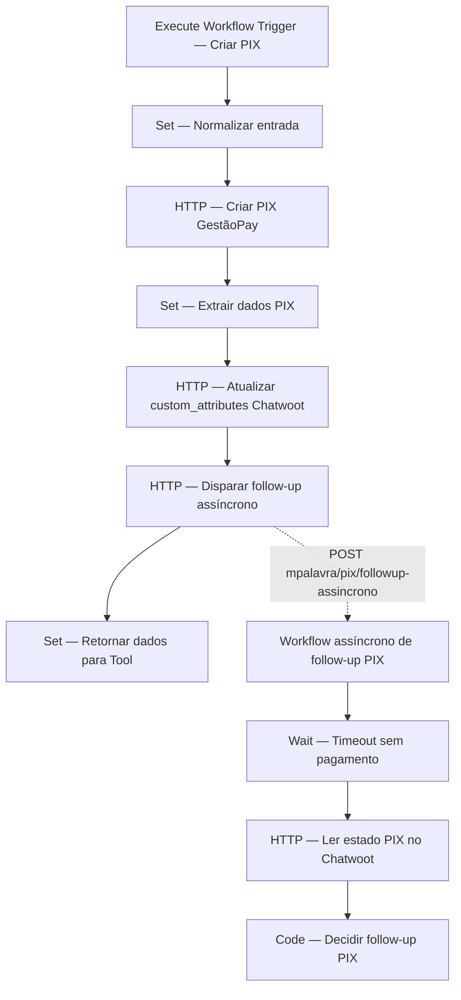
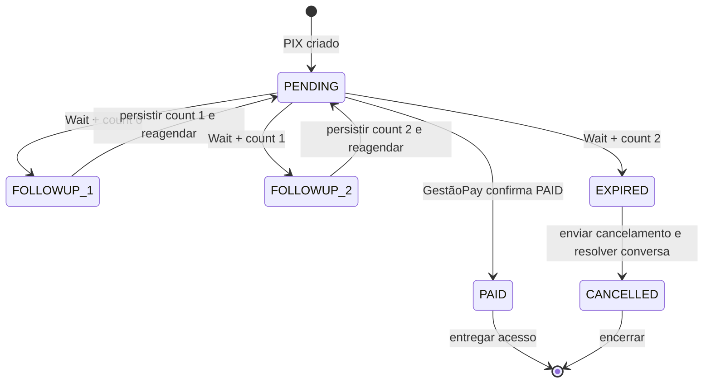
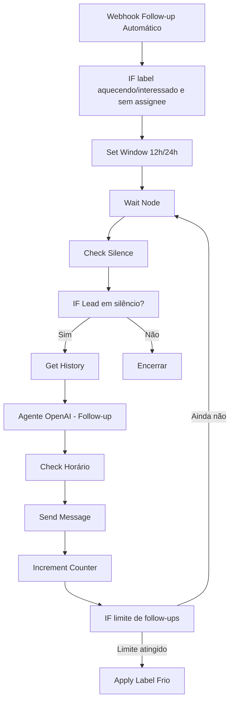

# Diagramas

## Workflow 03 desejado — Tool síncrona + follow-up assíncrono

```mermaid
flowchart TD
  A["Execute Workflow Trigger — Criar PIX"] --> B["Set — Normalizar entrada"]
  B --> C["HTTP — Criar PIX GestãoPay"]
  C --> D["Set — Extrair dados PIX"]
  D --> E["HTTP — Atualizar custom_attributes Chatwoot"]
  E --> F["HTTP — Disparar follow-up assíncrono"]
  F --> G["Set — Retornar dados para Tool"]

  F -. "POST mpalavra/pix/followup-assincrono" .-> H["Workflow assíncrono de follow-up PIX"]
  H --> I["Wait — Timeout sem pagamento"]
  I --> J["HTTP — Ler estado PIX no Chatwoot"]
  J --> K["Code — Decidir follow-up PIX"]
```

## Máquina de estados do follow-up PIX

```mermaid
stateDiagram-v2
  [*] --> PENDING: PIX criado
  PENDING --> PAID: GestãoPay confirma PAID
  PENDING --> FOLLOWUP_1: Wait + count 0
  FOLLOWUP_1 --> PENDING: persistir count 1 e reagendar
  PENDING --> FOLLOWUP_2: Wait + count 1
  FOLLOWUP_2 --> PENDING: persistir count 2 e reagendar
  PENDING --> EXPIRED: Wait + count 2
  EXPIRED --> CANCELLED: enviar cancelamento e resolver conversa
  PAID --> [*]: entregar acesso
  CANCELLED --> [*]: encerrar
```

## Workflow 04 — Follow-up de silêncio de leads

```mermaid
flowchart TD
  A["Webhook Follow-up Automático"] --> B["IF label aquecendo/interessado e sem assignee"]
  B --> C["Set Window 12h/24h"]
  C --> D["Wait Node"]
  D --> E["Check Silence"]
  E --> F["IF Lead em silêncio?"]
  F -->|Sim| G["Get History"]
  G --> H["Agente OpenAI - Follow-up"]
  H --> I["Check Horário"]
  I --> J["Send Message"]
  J --> K["Increment Counter"]
  K --> L["IF limite de follow-ups"]
  L -->|Limite atingido| M["Apply Label Frio"]
  L -->|Ainda não| D
  F -->|Não| N["Encerrar"]
```
